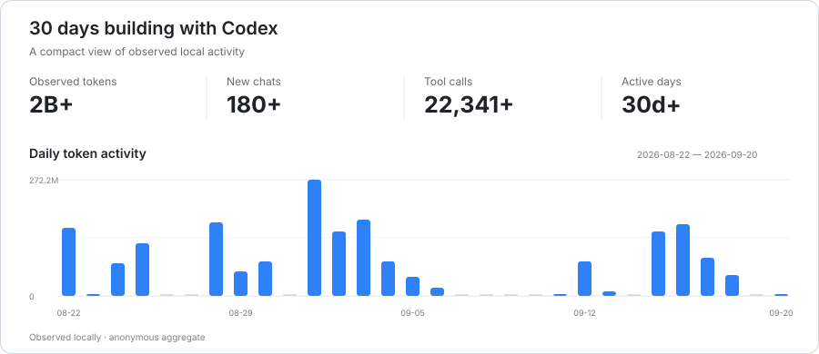

# Daehyeon Ryu

**Front-end Engineer**

**Built for the domain. Clear to the team. Flexible for what comes next.**

  
  
  

[Website](https://ryudh.com) · [Resume](https://ryudh-dev-resume.vercel.app/)

---

## About

Front-end engineer with a background in web design and UI implementation.  
I've worked across product interfaces, design systems, and the front-end foundations that support them.

My strength is connecting design intent, domain rules, and code structure — from Figma and component APIs to state, data flow, and production code.

## What I work on

- **Product UI** — Building and refining interfaces with Next.js, TypeScript, and React.
- **Design systems** — Shaping component APIs, tokens, and shared foundations that stay consistent without becoming overly generic.
- **Front-end architecture** — Organizing state, data flow, module boundaries, and conventions so the codebase remains understandable as it grows.
- **Developer workflow** — Improving type safety, testing, monorepo workflows, and AI-assisted development with explicit review and verification.

## Codex activity

## Tools I reach for when they fit

`TanStack Query` · `Jotai` · `SCSS` · `pnpm` · `Turborepo` · `Figma`
