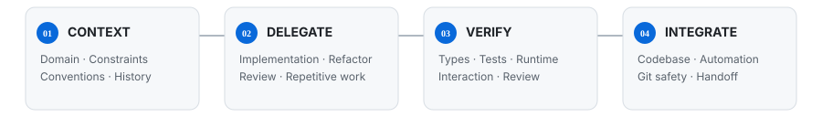

# Daehyeon Ryu

**Front-end Engineer**

**Built for the domain. Clear to the team. Flexible for what comes next.**

`TypeScript` · `React` · `Next.js`

[Website](https://ryudh.com) · [Resume](https://ryudh-dev-resume.vercel.app/)

---

## About

Front-end engineer with a background in web design and UI implementation.

I work across product interfaces, design systems, and front-end foundations — connecting design intent, domain rules, and code structure.

## I work across

- **Product UI** — From design to production UI and interaction.
- **Design systems** — Components, tokens, APIs, and shared foundations.
- **Front-end architecture** — State, data flow, module boundaries, and conventions.
- **Developer workflow** — Type safety, testing, monorepos, and automation.

## Agent-Driven Development

**Human-led context, judgment, and verification.**

**Understand → Delegate → Verify → Integrate**

`Agent workflows` · `Runtime verification` · `Automation`

I use Codex for implementation, refactoring, review, and repeatable development work while keeping the product context and acceptance criteria explicit.

[한국어 보기 →](./assets/codex-activity-ko.svg) · [How it works](./docs/profile-activity.md)

## Tech Stack

**Core**

**Data & state**

**Tooling**

**Styling & design**

